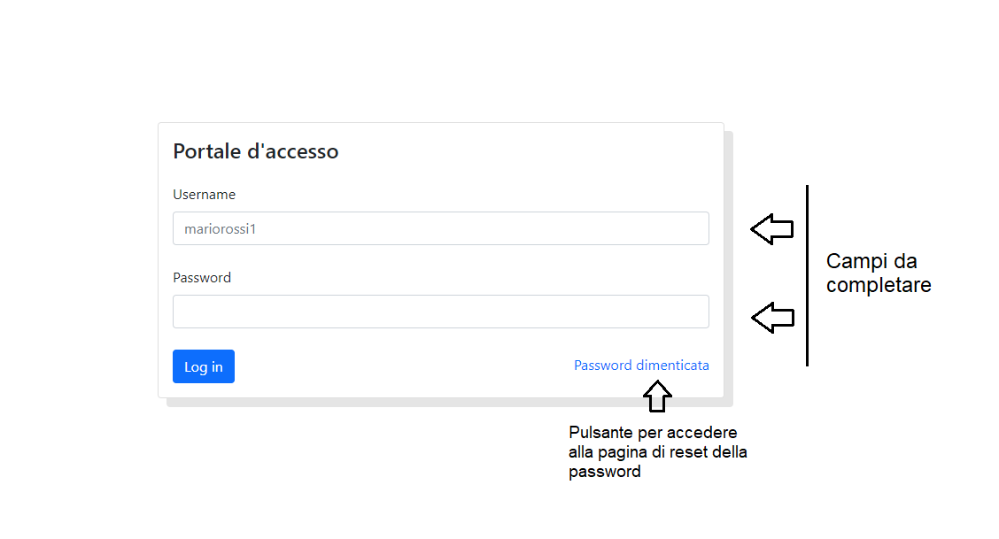

# Attivià Manutenzione  
Si può accdere al portale con l'ip '192.168.1.61' nel prorpio browser opure cliccando [qui](http://192.168.1.61).

 

## Indice
[Log in](#log-in)

[Password dimeticata](#password-dimenticata)

[Pagina principale](#home)

[Pagina sulle informazioni dettagliate ordine](#informazioni-sullordine)

[Pagina per cambiare la password](#cambio-password)

[Form per l'aggiunta di un ordine](#aggiunta-ordine)

 

## Le Pagine

### Log in
Nel login vanno inseriti l'**username** e la **password** nei corrispettivi campi, dopodiché premere il pulsante invio per accedere al portale.

*La pagina di accesso si presenterà nel seguente modo*:

</img>

Esiste l'opzione **password dimenticata**, la quale portarà ad una nuova pagina che chiederà di inserire la propria email

 

### Password Dimenticata
La pagina si presenta con un solo campo, dove andrà inserita l'email associata all'account del quale si desidera recuperare la password.

Fatto ciò verrà inviato un messaggio all'indirizzo inserito con una **nuova password**.

</img>

 

### Home
La pagina principale è composta da due parti:
- **La barra di navigazione**: Nella barra sono presenti diversi elementi:
    - **Attività Manutenzione**: Un pulsante che riporta alla pagina principale.
  
    - **Il nome**: Nome e cognome dell'utente.
  
    - **Cambia Password**: Pulsante che prota ad una pagina per cambiare la propria password.
    
    - **Log out**: Pulsante che effettua il log out (premendolo si verrà riportati alla pagina di log in).

    </img>

- **La tabella degli ordini**: In questa tabella saranno tutti gli ordini già effettuati con **id**, **Descrizione** e **stato**.
  
    </img>

    - Cliccando sull'**id** verrà aperta una nuova pagina con ulteriori informazioni sull'ordine selezionato.
    
    - Cliccando **Aggiungi ordine** si verrà indirizzati al form per l'aggiunta di un ordine.
  
 

### Informazioni sull'ordine
Dopo aver premuto un **id** nella pagina principale, si verrà indirazziti a questa tabella contenente tutte le informazioni su quel detereminato ordine.

La pagina presenta dei campi con **Tipo di dato** e **valore** corrispettivo.

</img>

 

### Cambio Password
La pagina di cambio password si presenta con due cmapi da inserire: Va inserita la **nuova password** nel primo campo, dopodichè semplicemente ripetere l'inserimento nel secondo per assicurarsi che la password inserita sia stata scritta nel modo corretto.

</img>

 

### Aggiunta Ordine
La pagine contiente diversi campi da completare con le informazioni sull'ordine:
- Stabilimento
  
- Reparto
- Impianto
- Zona
- Descrizione
- Allegato (*facoltativo*)

*Il form avrà la seguente struttura*:

</img>